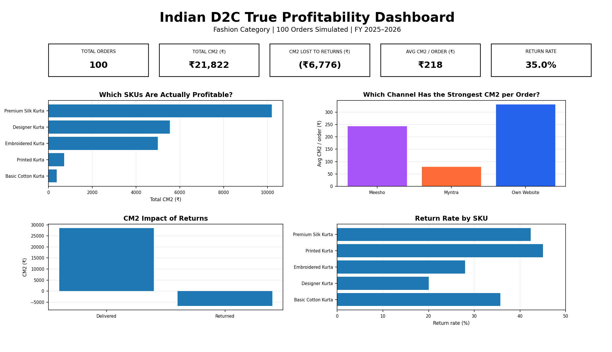
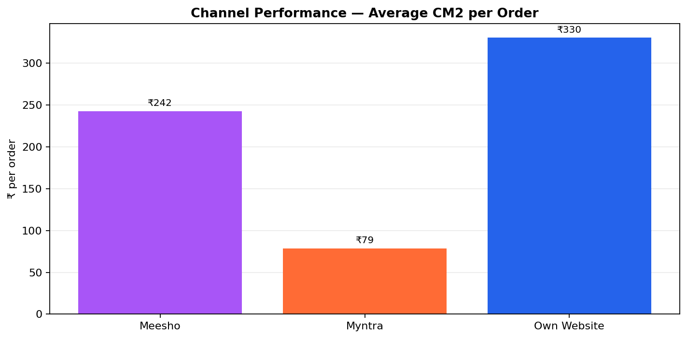
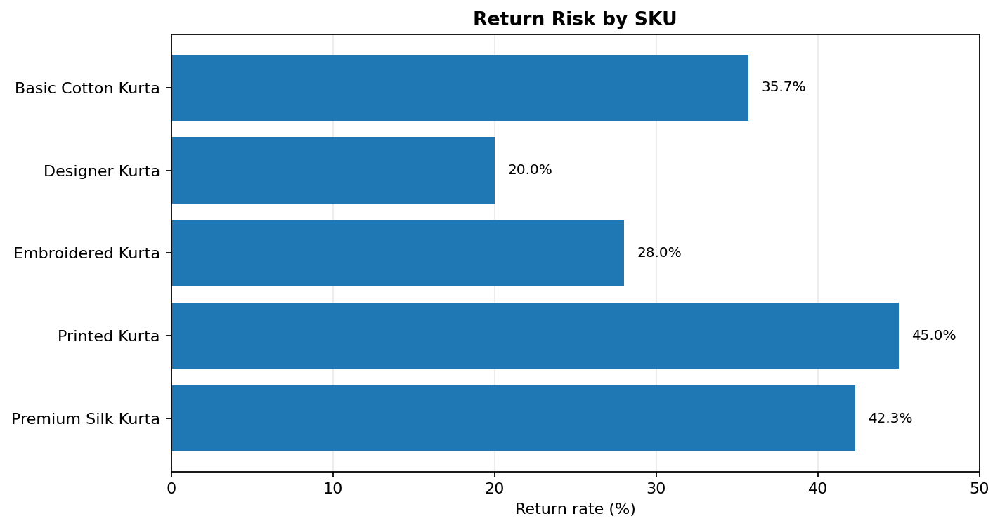

# 🇮🇳 Indian D2C True Profit Analysis

> **A practical contribution-margin analysis of a 100-order Indian D2C fashion (Kurta) dataset, built in Microsoft Excel 2021.**

This project analyzes **true order-level profitability** after accounting for platform commissions, fixed fees, shipping, COD handling, GST on fees, packaging, and return-related losses.

The README is based on the current Excel model and the previous **`profit_model_summary.docx`** report, with the actual dataset result clearly separated from the 30% base-case scenario.

---

## 📊 Dashboard



The dashboard focuses on four questions:

- Which SKUs contribute the most CM2?
- Which sales channel gives the strongest CM2 per order?
- How much CM2 is being lost through returns?
- Which SKUs have the highest return rates?

---

## 🔎 Key Results

| Metric | Current Dataset |
|---|---:|
| Orders | **100** |
| Delivered Orders | **65** |
| Returned Orders | **35** |
| Observed Return Rate | **35.0%** |
| Actual Total CM2 | **₹21,821.62** |
| Average CM2 / Order | **₹218.22** |
| Average CM2 — Delivered Order | **₹439.96** |
| Average CM2 — Returned Order | **₹-193.59** |
| CM2 Lost to Returns | **₹6,775.72** |

### Important distinction

The **actual dataset has a 35% observed return rate**, while the earlier report used **30% as a planning/base-case assumption**.

At the 30% base case, projected CM2 is approximately **₹24,989.38**.

This distinction is kept intentionally so the analysis does not confuse an assumption with an observed result.

---

## 📈 Channel Performance



Average CM2 per order:

- **Own Website:** ₹330.39
- **Meesho:** ₹242.50
- **Myntra:** ₹78.73

The model shows that **Own Website has the strongest average CM2 per order**. The difference is primarily driven by channel economics and fee structures rather than simply operational performance.

---

## 🛍️ SKU Profitability

The strongest SKU by total CM2 is:

**Premium Silk Kurta — ₹10,200.93**

The weakest SKU by total CM2 is:

**Basic Cotton Kurta — ₹373.15**

This supports the previous report's recommendation to protect the higher-contribution Premium Silk Kurta while reviewing the economics of the Basic Cotton Kurta.

---

## 🔄 Return Risk



Observed return rates by SKU:

| SKU | Delivered | Returned | Return Rate |
|---|---:|---:|---:|
| Basic Cotton Kurta | 9 | 5 | 35.7% |\n| Designer Kurta | 12 | 3 | 20.0% |\n| Embroidered Kurta | 18 | 7 | 28.0% |\n| Printed Kurta | 11 | 9 | 45.0% |\n| Premium Silk Kurta | 15 | 11 | 42.3% |\n
The highest observed SKU return rate is **Printed Kurta at 45.0%**.

---

## 💡 Business Recommendations

### 1. Reduce returns before increasing acquisition spend
Returns have a direct negative impact on CM2. Focus on better size guidance, clearer product information, product demonstrations, and post-purchase communication.

### 2. Shift incremental acquisition toward the Own Website
The Own Website has the highest average CM2 per order in the model. Direct customer acquisition can therefore create stronger contribution economics than marketplace-heavy growth.

### 3. Protect and expand Premium Silk Kurta
Premium Silk Kurta contributes the highest total CM2 in the catalogue. Similar styles, colours, and occasions can be explored around this stronger product economics.

### 4. Review Basic Cotton Kurta
Basic Cotton Kurta generates only **₹373 total CM2** in the current dataset. Review its return rate, pricing, shipping economics, and marketplace mix before increasing its scale.

---

## 🧮 Scenario Analysis

The model shows a clear relationship between return rate and contribution margin.

| Scenario | Return Rate | Projected CM2 |
|---|---:|---:|
| Actual Dataset | 35% | ₹21,821.62 |
| Base Case | 30% | ₹24,989.38 |
| Optimistic | 20% | ₹31,324.89 |
| Pessimistic | 40% | ₹18,653.86 |
| Best Case | 10% | ₹37,660.40 |

The key takeaway is that **reducing returns improves CM2 without requiring additional customers or higher prices**.

---

## 🛠️ Tools & Methodology

**Tool:** Microsoft Excel 2021

The test dataset uses Excel-based randomization and choice logic, including `RANDBETWEEN` and `CHOOSE`.

The model incorporates assumptions around:

- Marketplace commissions
- Fixed marketplace fees
- Forward and reverse shipping
- COD handling
- GST on platform fees
- Packaging costs
- Product costs
- Returns

**CM2 (Contribution Margin 2)** is used as the primary profitability measure.

---

## 📁 Project Files

Place these files in the root of the GitHub repository:

```text
.
├── README.md
├── d2c_profit_model_GitHub_ready.xlsx
├── profit_model_summary_GitHub_ready.docx
└── assets/
    ├── dashboard-overview.png
    ├── channel-performance.png
    └── return-risk.png
```

### Main files

- **Excel Model:** `d2c_profit_model_GitHub_ready.xlsx`
- **Business Report:** `profit_model_summary_GitHub_ready.docx`

---

## 🎯 Project Objective

The objective is not simply to calculate revenue or gross profit.

It is to answer:

> **After all major variable selling and fulfilment costs, which orders, products, channels, and return behaviours actually create contribution margin?**

This makes the model useful for **D2C profitability analysis, channel strategy, SKU decisions, and return-risk management**.

---

## ⚠️ Data Note

This is a **100-order test dataset** designed around Indian D2C fashion economics. It should be treated as an analytical model rather than audited company financial data.

---

## 👤 Author

**Shubham Sarkar**

Indian D2C True Profit Analysis  
Fashion Category — Kurta  
Microsoft Excel 2021
